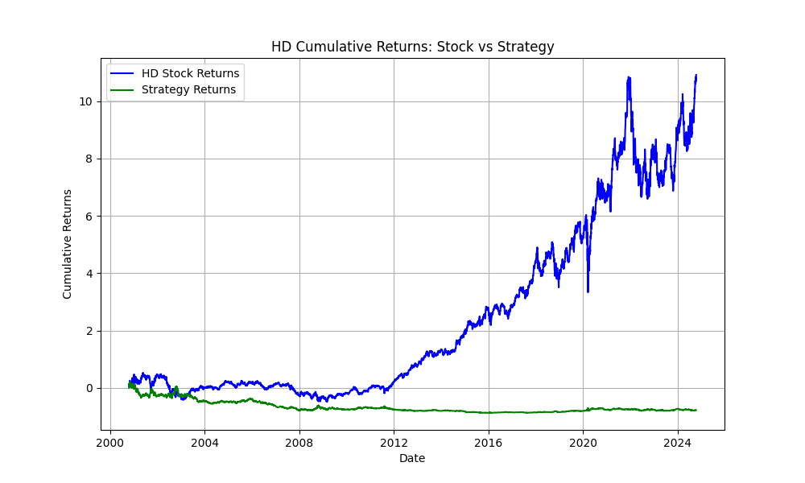

# Stock Examiner

A Python-based stock market analysis and backtesting tool that downloads historical stock data from Yahoo Finance, calculates various technical indicators, optimizes strategy parameters, and generates buy/sell signals. The results are saved to CSV files, and visualizations are produced as PNG plots.

## Features

- **Download Historical Stock Data** from Yahoo Finance using the `yfinance` library.
- **Technical Indicators**: Simple Moving Average (SMA), Exponential Moving Average (EMA), Relative Strength Index (RSI), and Moving Average Convergence Divergence (MACD).
- **Buy/Sell Signals** based on RSI and MACD.
- **Backtesting**: Evaluate trading strategy performance.
- **Performance Evaluation**: Includes metrics like annualized returns, volatility, and Sharpe ratio.
- **CSV Output**: Saves the stock data with calculated indicators and strategy results.
- **PNG Plot Output**: Visualize cumulative returns (Stock vs. Strategy).

## Example Output

- **PNG Plot Example:**



The plot above shows the cumulative returns for **Home Depot (HD)**, comparing stock returns (blue line) and the strategy returns (green line) over time from 2000-10-17 to 2024-10-17.

- **CSV File Example:**

The CSV file for Home Depot (**HD**) contains the following columns:

| Date       | Open  | High  | Low   | Close | Volume | SMA   | EMA   | RSI   | MACD  | MACD_Signal | Signal | Position | Stock_Returns | Strategy_Returns | Cumulative_Stock_Returns | Cumulative_Strategy_Returns |
|------------|-------|-------|-------|-------|--------|-------|-------|-------|-------|-------------|--------|----------|---------------|------------------|-------------------------|----------------------------|
| 2023-10-15 | 280.00| 290.00| 275.00| 287.00| 900000 | 283.50| 284.23| 58.34 | 0.75  | 0.60        | 0      | 0        | 0.001         | 0                | 0.03                    | 0.00                       |

This table contains stock data alongside technical indicators and buy/sell signals. You can find the entire file in the output folder as `HD_stock_analysis.csv`.

## Installation

### Prerequisites

- **Python 3.x**: Ensure you have Python 3.x installed on your system.
- **Python Libraries**: Install the necessary Python libraries with the following command:

```bash
pip install -r requirements.txt
```

The `requirements.txt` includes the following packages:

```
matplotlib
numpy
pandas
yfinance
pytest
```

### How to Run the Program

1. **Download the Repository**:
   Clone the repository from GitHub:

   ```bash
   git clone https://github.com/yourusername/stock-examiner.git
   cd stock-examiner
   ```

2. **Run the Program**:
   You can specify the date range when running the script. If no dates are provided, it will default to a range from `2000-10-17` to `2024-10-17`.

   ```bash
   python stockexaminer.py 2000-01-01 2024-10-17
   ```

   Alternatively, simply run the program with no arguments for default dates:

   ```bash
   python stockexaminer.py
   ```

3. **Add Ticker Symbols**:
   When prompted, enter the stock ticker symbols you want to analyze (e.g., `HD` for Home Depot). Type `stop` when you are done entering tickers.

4. **View Outputs**:
   - The results are saved as a CSV file in the `output` folder (e.g., `HD_stock_analysis.csv`).
   - A plot comparing cumulative stock returns and strategy returns will be generated and saved as a PNG file in the `output` folder (e.g., `HD_cumulative_returns.png`).

## Testing

Unit tests are included to ensure the functions work as expected. The tests are written using the `pytest` framework.

To run the tests, use the following command:

```bash
pytest
```

These tests validate the following:
- Calculation of technical indicators (SMA, EMA, RSI, MACD).
- Generation of buy/sell signals.
- Evaluation of strategy performance.

The test results will be displayed in your terminal.

## Project Structure

```
├── stockexaminer.py            # Main script for stock analysis
├── test_stockexaminer.py       # Unit tests
├── requirements.txt            # Dependencies
├── README.md                   # Project documentation
├── LICENSE                     # License information
└── output/                     # Directory for output CSVs and PNG plots
```

## License

This project is licensed under the MIT License - see the [LICENSE](./LICENSE) file for details.

## Contributing

Contributions are welcome! If you have any ideas or improvements, feel free to fork the repository and submit a pull request.

## Contact

For any questions, feel free to reach out to [Angel Jimenez](mailto:angeljimenez@domain.com).
